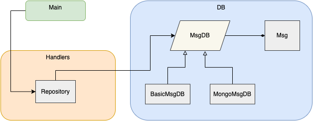

# Palermo

RESTful API for managing messages. It stores and provides details about these messages, specifically whether a message is a palindrome

## Build & Run

``` shell
git clone https://github.com/uritrejo/palermo.git
cd palermo
./scripts/build.sh  # will run go build, go test, create binaries
./bin/palermo
>> time="2022-03-27T15:47:12-04:00" level=info msg="Palermo server is listening on localhost:4422"
```

### Options
Run `./bin/palermo -h` to see the flags available:
```shell
Usage of ./bin/palermo:
  -dbtype string
        -dbtype=<type>: types are 'basic' (local memory) and 'mongodb (default "basic")
  -loglevel string
        -loglevel=<level>: levels are info, debug, trace (default "debug")
  -mongodb-addr string
        -mongodb-addr=<host>:<port>: port where mongo db is listening (default "localhost:27017")
  -port int
        -port=<port>: port on which to listen and serve (default 4422)
  -tlscert string
        -tlscert=<path_to_cert.pem>: path to PEM encoded certificate file (if tls is required). tlskey must also be set for tls to be used
  -tlskey string
        -tlskey=<path_to_key.pem>: path to PEM encoded private key file
```

## Architecture



## Paths
Refer to [api/APIdoc.html](api/APIdoc.html) for details on the API paths.
Summary & Examples with curl:
- /v1/createMsg POST
    - `curl -X POST localhost:4422/v1/createMsg -H "Content-Type: application/json" -d '{"id":"1", "content":"kayak"}'`
- /v1/retrieveMsg/{id} GET
    - `curl localhost:4422/v1/retrieveMsg/1`
- /v1/retrieveAllMsgs GET
    - `curl localhost:4422/v1/retrieveAllMsgs`
- /v1/updateMsg/{id} POST
    - `curl -X POST localhost:4422/v1/updateMsg/1 -H "Content-Type: application/json" -d '{"id":"1", "content":"canoe"}'`
- /v1/deleteMsg/{id} GET
    - `curl localhost:4422/v1/deleteMsg/1`
    